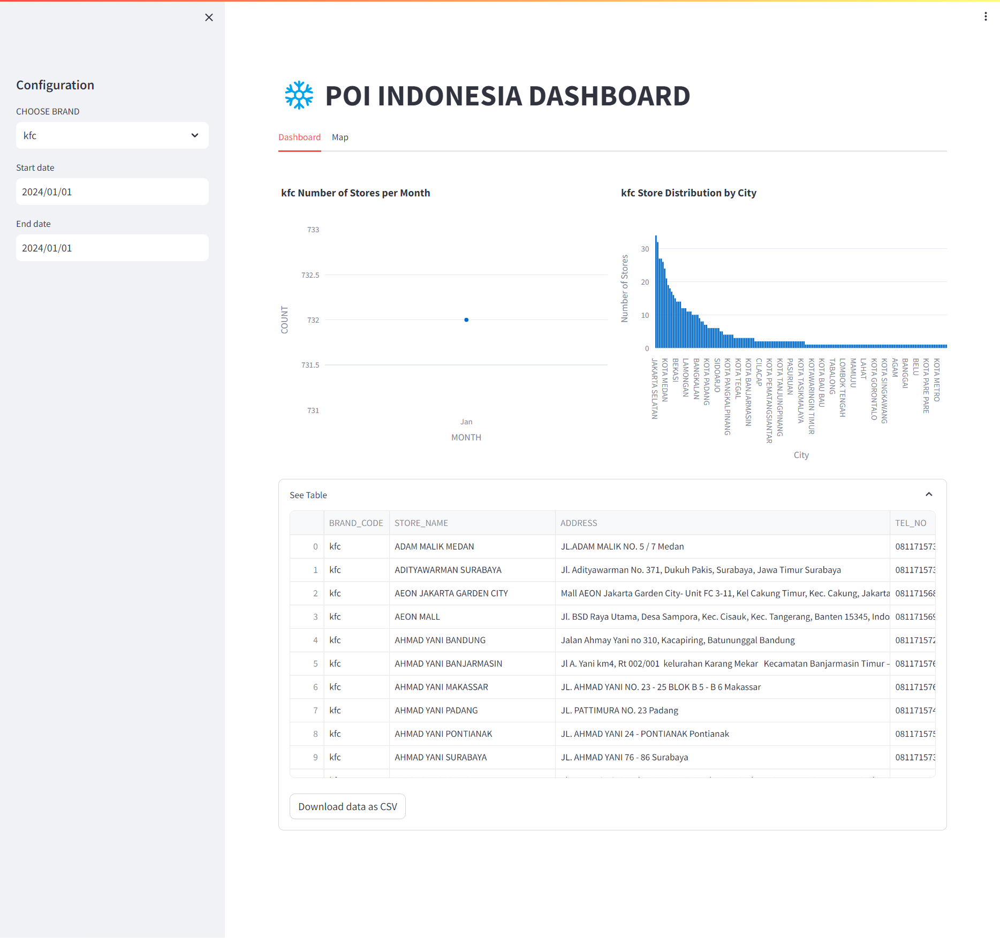
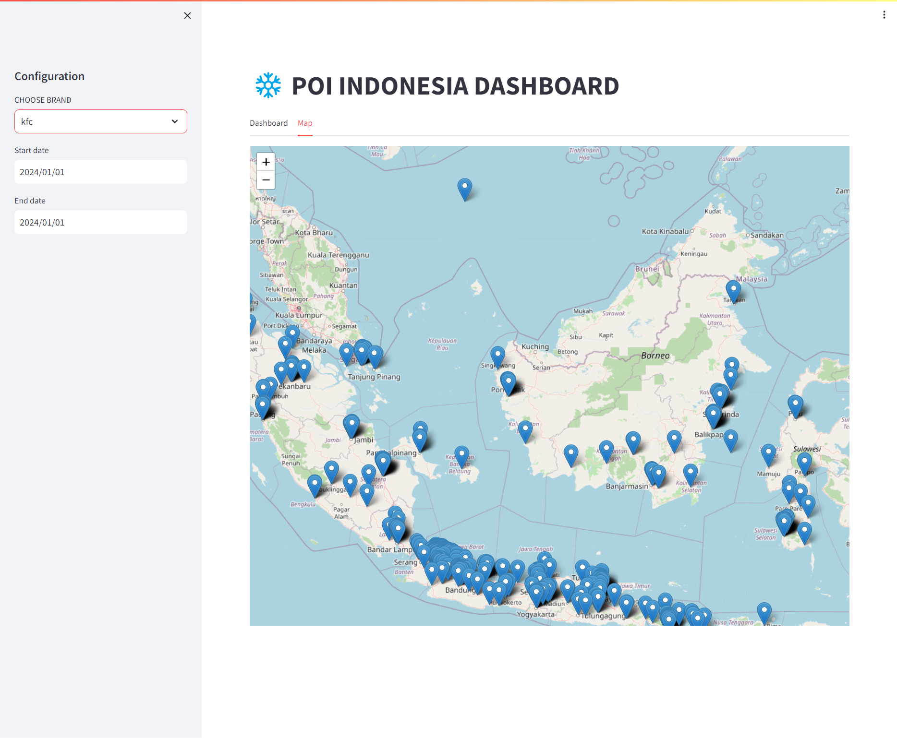

# POI Indonesia Project

Welcome to the POI (Points of Interest) Indonesia project! This project aims to create a comprehensive database of Points of Interest in Indonesia, offering valuable geospatial information.

## Table of Contents

I. [Introduction](#introduction)
II. [Data Pipeline](#data-pipeline)
III. [Data Visualization with Streamlit](#exploratory-data-analysis)

## Introduction
The term "POI" stands for "Points of Interest." In the context of this project, POIs refer to significant locations that capture interest due to their unique characteristics, cultural importance, or commercial significance. From well-known brands like Uniqlo and KFC to local landmarks, this project aims to compile a comprehensive dataset of diverse Points of Interest in Indonesia.
## Project Objectives

Our primary objectives are as follows:

1. **Extract Relevant Data:**
   - Identify and extract essential data elements related to Points of Interest in Indonesia.
2. **Data Standardization:**
   - Standardize the extracted data for consistency, accuracy, and completeness.
3. **Data Loading:**
   - Load the transformed data into a data warehouse, making it easy to query and analyze.
4. **User-Friendly Interface:**
   - Develop an interface for users to access and query the Points of Interest data easily.
5. **Reporting and Visualization:**
   - Enable users to generate reports and visualizations to support decision-making.
6. **Quick Insight:**
   - Provide a mechanism for quick insights into the dataset.
     
## Data Pipeline

The data pipeline section outlines the process of collecting, processing, and organizing Points of Interest data. It covers the steps involved in building a robust pipeline to ensure the accuracy and completeness of the dataset.

## Data Visualization with Streamlit

The interactive data visualization app is deployed on [Streamlit Cloud](https://poi-indonesia-w6po9npdo3bwsfzhdzjvnc.streamlit.app/). Feel free to interact with the application to explore the Points of Interest dataset in a user-friendly manner.(the project contains a limited dataset with only two Points of Interest (for example, Uniqlo and KFC), and the data is representative of January 2023. We plan to expand and update the dataset continuously to encompass a broader range of Points of Interest and include data from various timeframes.)

